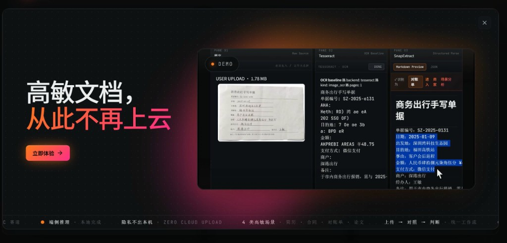
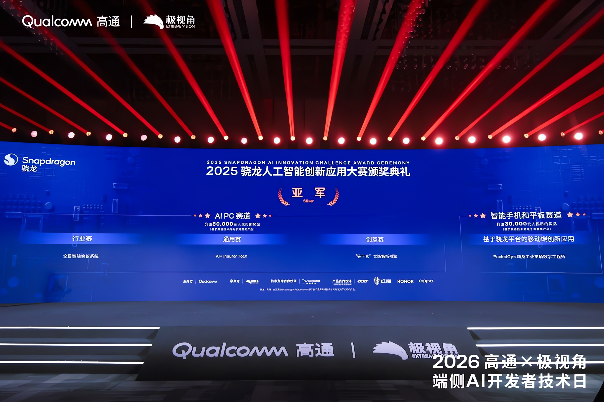

<div align="center">

# 答于言 · 文档解析引擎

**DaYuYan-engine** — 完全跑在 Snapdragon NPU 上的本地文档理解引擎

不是 OCR，是 OCR 之上的判断引擎。高敏文档，从此不再上云。

[](https://github.com/Maropion03/DaYuYan-engine)
[](#荣誉)
[](docs/01_技术架构说明.md)
[](#五四个演示场景)
[](#二系统要求)
[](#五四个演示场景)

[演示](#演示) · [荣誉](#荣誉) · [安装](#三安装步骤) · [架构](docs/01_技术架构说明.md) · [API](docs/02_API_接口说明.md)

</div>

---

## 演示

<div align="center">



*端侧推理 · 隐私不出本机 · 4 类高敏场景（简历 / 合同 / 对账 / 论文）*

</div>

---

## 荣誉

<div align="center">



</div>

| 赛事 | 赛道 | 奖项 |
|------|------|------|
| 2025 骁龙人工智能创新应用大赛 | AI PC 赛道 · 创意赛 | **亚军** |

> 颁奖典礼：2025 骁龙人工智能创新应用大赛颁奖典礼（高通 × 极视角等联合主办）。

---

## 一、提交内容清单

| 编号 | 内容 | 路径 |
|------|------|------|
| 01 | 应用效果演示视频（2 分 51 秒，1080p） | `01_演示视频/答于言文档解析引擎_演示视频.mp4` |
| 02 | 决赛答辩 PPT | `02_答辩PPT/答于言文档解析引擎.pptx` |
| 03 | 完整应用安装包（前端 + 三层后端服务） | `03_应用安装包/` |
| 04 | 项目技术文档与架构说明 | `04_技术文档/` |
| —  | 本文件（总入口安装说明） | `README.md` |

---

## 二、系统要求

| 项 | 要求 |
|----|------|
| 设备 | Snapdragon X Elite / X Plus 笔记本（NPU 必备） |
| 操作系统 | Windows 11（24H2 及以上推荐） |
| 内存 | 16 GB 起步 |
| 磁盘 | 安装包解压后约 60 MB；模型权重另需 ~3 GB |
| 浏览器 | Microsoft Edge / Chrome 最新版 |

**前置依赖软件：**

1. **Snapdragon AI Engine Direct Helper SDK**
   - 高通官方提供，含 `GenieAPIService.exe` 和 Qwen2.5-VL-3B 量化权重
   - 默认安装位置：`C:\Users\<你>\Desktop\snapdragon\ai-engine-direct-helper-main\samples\`
2. **Python 3.10+**（系统全局，运行前端代理服务用）
3. **Conda（Miniconda/Anaconda）**
   - 用于创建场景分析后端的独立 Python 环境
4. **Tesseract OCR for Windows**
   - 通过 winget 安装：`winget install --id UB-Mannheim.TesseractOCR`
   - 默认装到 `C:\Program Files\Tesseract-OCR\`

---

## 三、安装步骤

### 步骤 1 · 解压本提交包到目标位置

推荐解压到 `C:\Users\<你>\Documents\答于言\`，结构如下：

```
答于言_提交包/
├── 01_演示视频/
├── 02_答辩PPT/
├── 03_应用安装包/
│   ├── frontend/        # 前端 HTML + 静态资源 + Tesseract 代理
│   └── backend/         # OCR / Qwen / 场景分析三层服务
└── 04_技术文档/
```

### 步骤 2 · 安装 Snapdragon AI Engine Direct Helper SDK

按高通官方指引下载 `ai-engine-direct-helper-main`，将其放置在：

```
C:\Users\<你>\Desktop\snapdragon\ai-engine-direct-helper-main\
```

并把 `qwen2.5vl3b` 模型权重放入：

```
samples\genie\python\models\qwen2.5vl3b\
├── config.json
├── embedding_weights_151936x2048.raw
├── llm_model-0.bin
├── llm_model-1.bin
├── tokenizer.json
└── ...（其他模型文件）
```

> 模型权重约 3 GB，受提交包大小限制（200 MB）无法随包附带。

### 步骤 3 · 创建场景分析后端的 Conda 环境

```powershell
cd 03_应用安装包\backend
conda create -p .\.conda-ocr python=3.10 -y
conda activate .\.conda-ocr
pip install paddlepaddle==2.6.2 paddleocr==2.7.3 pytesseract fastapi uvicorn python-multipart pymupdf pillow
```

### 步骤 4 · 安装 Tesseract OCR

```powershell
winget install --id UB-Mannheim.TesseractOCR
```

安装后无需手动配置 PATH —— 启动脚本会自动指向 `C:\Program Files\Tesseract-OCR\`。

### 步骤 5 · 调整启动脚本路径（如解压位置不是默认）

打开 `03_应用安装包\backend\start_*.ps1`，把开头的：

```powershell
$root = "C:\Users\1\Documents\Codex\2026-05-13\ocr-qwen-ai"
```

替换成你实际的 `backend\` 绝对路径。同理调整 `start_qwen25vl3b.ps1` 中的 SDK 路径。

---

## 四、启动应用

### 一键启动（推荐）

**双击** `03_应用安装包\start_all.cmd` —— 自动按顺序起 4 个服务、验证端口、打开浏览器。

或者在 PowerShell 一行执行：

```powershell
& "<PKG>\03_应用安装包\start_all.cmd"
```

成功的话最后会看到 4 个绿色 ✔ 然后自动跳转 http://localhost:8000/snapextract_v3.html

### 手动逐个启动（仅当一键脚本出问题时排查用）

> **重要：用绝对路径**。下面命令把 `<PKG>` 替换成你的项目根目录（即 `03_应用安装包` 所在父目录的完整路径），不要依赖 `cd` 当前所在位置。

依次启动 4 个服务（建议各开一个 PowerShell 窗口）：

```powershell
# 1. Qwen NPU 推理服务（端口 8910）
& "<PKG>\03_应用安装包\backend\start_qwen25vl3b.cmd"

# 2. 场景分析后端（端口 8766）
& "<PKG>\03_应用安装包\backend\start_scene_runtime.cmd"

# 3. 前端静态服务（端口 8000）
& "<PKG>\03_应用安装包\backend\start_frontend.cmd"

# 4. Tesseract + 多模态代理（端口 8765）
cd "<PKG>\03_应用安装包\frontend"
python proxy.py
```

**示例（解压 / clone 到桌面时）：**

```powershell
& "C:\Users\<你>\Desktop\答于言_提交包\03_应用安装包\backend\start_qwen25vl3b.cmd"
& "C:\Users\<你>\Desktop\答于言_提交包\03_应用安装包\backend\start_scene_runtime.cmd"
& "C:\Users\<你>\Desktop\答于言_提交包\03_应用安装包\backend\start_frontend.cmd"
cd "C:\Users\<你>\Desktop\答于言_提交包\03_应用安装包\frontend"
python proxy.py
```

启动成功后，浏览器打开：

```
http://localhost:8000/snapextract_v3.html
```

**验证 4 个服务全部在线：**

```powershell
netstat -ano | findstr ":8765 :8766 :8000 :8910" | findstr LISTENING
```

应该看到 4 行（每个端口一行）。少任何一行就是对应服务没起来，回头看那个服务的启动输出排查。

---

## 五、四个演示场景

应用首页提供 4 个内置样例，对应视频中的 4 个场景：

| 场景 | 样例文件 | 演示要点 |
|------|----------|----------|
| 论文 | `LCM-LoRA 技术报告` | 标题/作者/公式/图表结构化 → 端侧研究方向匹配判断 |
| 简历 | `候选人简历` | 一次抽取教育/工作/技能 → JD 匹配评分 + 面试问题 |
| 合同 | `服务合同主版本 + 对方修改版` | 5 处变更对比 → 风险标记 + 履约里程碑 |
| 对账 | `手写报销单 + 银行流水` | 大写金额识别 → 自动核对 → 税额计算 |

点击任意场景卡片即可一键加载样例并进入解析。

---

## 六、目录结构详解

```
03_应用安装包/
├── frontend/
│   ├── snapextract_v3.html          # 主前端 SPA（核心 UI + 业务逻辑）
│   ├── snapextract_parse_assets.js  # 解析路径辅助资源
│   ├── snapextract_local_config.json # 本地配置（服务地址等）
│   ├── proxy.py                      # 端口 8765 多功能代理：
│   │                                 #   /chat   → 转发到 Qwen :8910
│   │                                 #   /ocr    → 调用本地 Tesseract
│   │                                 #   /pdf    → PyMuPDF 文本层抽取
│   ├── serve_snapextract.py          # （备用）独立静态服务
│   ├── demo_sample_files_public/    # 4 个场景的演示样例 + 渲染产物
│   ├── vendor/pdfjs/                # PDF.js 离线副本
│   └── docs/                        # 前端架构 + 接口说明
└── backend/
    ├── start_qwen25vl3b.cmd/.ps1    # 启动 Qwen NPU 推理（:8910）
    ├── start_scene_runtime.cmd/.ps1 # 启动场景分析（:8766）
    ├── start_frontend.cmd/.ps1      # 启动前端静态服务（:8000）
    ├── stop_qwen_service.ps1        # 停止 Qwen 服务
    ├── serve_snapextract.py         # HTTP 文件服务实现
    ├── scene_runtime/               # 场景深度分析 FastAPI 应用
    │   ├── app.py                   # FastAPI 入口
    │   ├── analysis.py              # 4 场景分析路由
    │   ├── contracts.py             # JSON 输出契约
    │   └── plugins/                 # 4 场景专用解析器
    └── tessdata/                    # Tesseract 语言包（chi_sim + eng + osd）
```

---

## 七、四服务架构图

```
浏览器 (Edge / Chrome)
   │
   │  http://localhost:8000/snapextract_v3.html
   ▼
┌──────────────────────────────────────────────────────┐
│  serve_snapextract.py    端口 8000                    │
│  纯静态文件服务（HTML / JS / 演示样例）                  │
└──────────────────────────────────────────────────────┘
   │
   │  fetch /chat /ocr /pdf
   ▼
┌──────────────────────────────────────────────────────┐
│  proxy.py                端口 8765                    │
│  统一代理 + Tesseract 直调 + PyMuPDF 文本层抽取         │
└──────────┬────────────────────────────┬──────────────┘
           │                            │
           │ /chat 转发                  │ /api/scene-analysis/run
           ▼                            ▼
  ┌──────────────────┐         ┌───────────────────────┐
  │ GenieAPIService  │         │ scene_runtime/app.py  │
  │ 端口 8910 (NPU)  │         │ 端口 8766 (CPU)        │
  │ Qwen2.5-VL-3B    │         │ FastAPI 场景深度分析   │
  └──────────────────┘         └───────────────────────┘
```

---

## 八、常见问题

**Q1：Qwen 接口报 `Model query unavailable`**
A：检查 `GenieAPIService.exe` 是否真的在 8910 端口运行。`netstat -ano | findstr :8910` 应该有 LISTENING。若端口在但查询失败，重启 Qwen 服务即可（`stop_qwen_service.ps1` 然后 `start_qwen25vl3b.cmd`）。

**Q2：上传文档后所有字段为空**
A：四个服务都需启动。确认 `netstat -ano` 列出 8000 / 8765 / 8766 / 8910 全部在 LISTENING。

**Q3：模型上下文报错 `Query Context Failed` / `Graph 256 is invalid`**
A：Qwen 2.5-VL-3B 编译产物的上下文上限为 2048 token。本前端已严格控制 prompt 长度在该范围内；若你自己改了 prompt，注意保留余量。

**Q4：手写票据识别为乱码**
A：这正是本项目相对传统 OCR 的优势。视频中可看到 Tesseract 把"¥48.75"读成"羊48.75"——本应用通过 Qwen 多模态视觉直读，能给出正确结果"¥48.75（人民币肆拾捌元柒角伍分）"。

**Q5：能否在非 Snapdragon 设备上运行？**
A：不能。本项目核心价值就是利用 Snapdragon NPU 实现完全端侧的多模态推理，无 NPU 时 Qwen 服务无法启动。

---

## 九、联系方式

- 团队：上海守扣科技
- 项目：答于言 文档解析引擎
- 演示日期：2026 年 5 月

---
